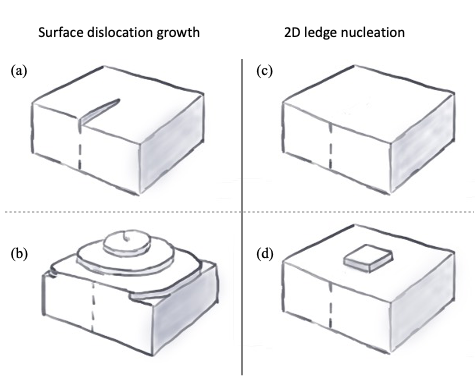

# Depositional Ice Growth Analysis for the IsoCloud Experiments



## Overview
This repo contains the analysis code for the paper "Re-evaluating cloud chamber constraints on depositional ice growth in cirrus clouds – Part 1: Model description and sensitivity tests". 

## Citation

The preprint for this paper can be found at:

```
@Article{acp-2022-733,
AUTHOR = {Lamb, K. D. and Harrington, J. Y. and Clouser, B. W. and Moyer, E. J. and Sarkozy, L. and Ebert, V. and M\"ohler, O. and Saathoff, H.},
TITLE = {Re-evaluating cloud chamber constraints on depositional ice growth in cirrus clouds -- Part 1: Model description and sensitivity tests},
JOURNAL = {Atmospheric Chemistry and Physics Discussions},
VOLUME = {2022},
YEAR = {2022},
PAGES = {1--29},
URL = {https://acp.copernicus.org/preprints/acp-2022-733/},
DOI = {10.5194/acp-2022-733}
}
```
## Content
- [Data Preparation](#data-preparation)
- [Parcel Model Analysis](#analysis)
- [DiskIce](#DiskIce)
- [Data Availability](#DataAvailability)

## Data Preparation

Data sets from the IsoCloud experiments are preprocessed using the AIDA Preprocessing.ipynb notebook. These data sets are used to initialize the parcel model described in Zhang and Harrington, 2014. The parcel model has been adopted for the AIDA chamber, and includes different parameterizations for the deposition coefficient. The Lagrangian parcel
model code used in this analysis was provided by Jerry Y. Harrington. 

## Parcel Model Analysis

Output from the parcel model are analysed in the ParcelModelOutput.ipynb notebook.

## DiskIce
The DiskIce.ipynb notebook contains code to plot the parameterizations for deposition coefficient function used in the parcel model. 

## Data Availability
Data sets for the IsoCloud 4 campaigns used in this analysis can be found at 
